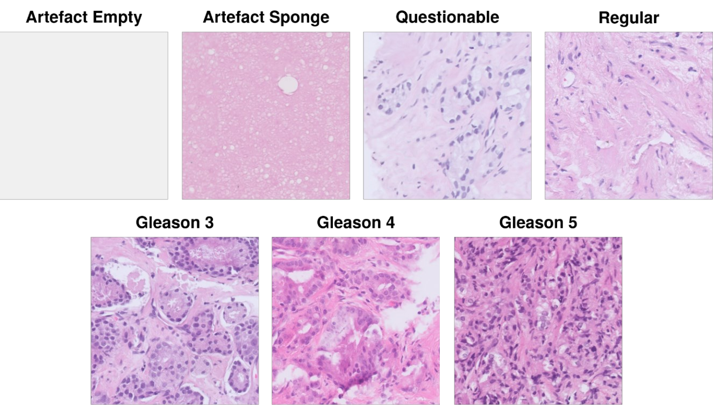
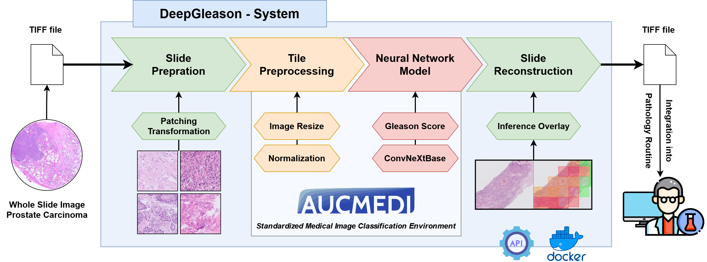
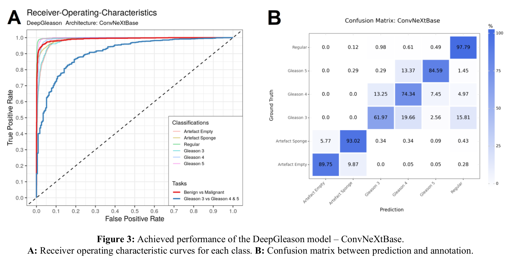

# DeepGleason: a System for Automated Gleason Grading of Prostate Cancer using Deep Neural Networks

Welcome to DeepGleason, an advanced software solution developed for inferring Gleason grading in prostate whole-slide images using a deep neural network. Our API is designed to assist pathologists and researchers in accurately analyzing and grading prostate tissue samples. With a focus on precision and efficiency, DeepGleason integrates seamlessly into existing workflows, providing a reliable tool for enhancing the diagnostic process. Explore the capabilities of our software and streamline your prostate cancer assessment with DeepGleason's neutral and effective approach to Gleason grading.


It computes a one of the following 6 classes per 1024 x 1024 tile: 
Artifact - Sponge, Artifact Dirt, PIN, precursor or unclear tissue, Regular Tissue, Gleason 3, Gleason 4, Gleason 5



## Usage

**Example:**  
```sh
cd DeepGleason/
python code/main.py   --input /sandbox/9f3fae7a6ff12c76fbbf89b9c50c66b6.ome.tiff \
                      --output /sandbox/ \
                      --model models/model.ConvNeXtBase.hdf5 \
                      --predictions /sandbox/predictions.csv
```

**Input**: 
- Whole-slide image of prostata cancer
- DeepGleason deep neural network model

**Output**: 
- BigTiff of computed classes as overlay
- CSV file containing class predictions & confidence for each tile

```sh
usage: code/main.py [-h] [-g GPU] [--cache CACHE] -i INPUT [-o OUTPUT] [--model MODEL] [--generate_overlay] [-p PREDICTION]

DeepGleason: Prediction

optional arguments:
  -h, --help            show this help message and exit
  -g GPU, --gpu GPU     GPU ID selection for multi cluster
  --cache CACHE         The location for temporary files that care generated during generation
  -i INPUT, --input INPUT
                        Path to the input slide
  -o OUTPUT, --output OUTPUT
                        Path where the slides are stored
  --model MODEL         Model the XAI is computed upon
  --generate_overlay    merge prediction distribution with base image as overlay
  -p PREDICTION, --predictions PREDICTION
                        output CSV containing predicted soft labels
```

## Installation

Download Git repository:
```sh
git clone https://github.com/frankkramer-lab/DeepGleason.git
cd DeepGleason/
git lfs pull
```

This repository contains `requirements.txt`. Use it to install the dependencies as such:
```sh
pip install -r requirements.txt
```

One of these dependencies is pyvips. PyVIPS may require the installation of LibVIPS on the system. Please refer to their installation guide [here](https://github.com/libvips/pyvips).

## Methodology & Performance

This program utilizes the PyVIPS library to load and store images and AUCMEDI to run the model. 

The implemented medical image classification pipeline can be summarized in the following core steps:
- Slide preparation with PyVIPS: 1024x1024 pixel tiles
- Tile preprocessing: Padding, resize, pixel intensity normalization
- Deep Learning model architecture: ConvNeXt
- Slide reconstruction to bigTIFF overlay



### Based on Framework: AUCMEDI


The open-source software AUCMEDI allows fast setup of medical image classification pipelines with state-of-the-art methods via an intuitive, high-level Python API or via an AutoML deployment through Docker/CLI.

[https://github.com/frankkramer-lab/aucmedi](https://github.com/frankkramer-lab/aucmedi)

This pipeline was based on AUCMEDI, which is an in-house developed open-source framework to setup complete medical image classification pipelines with deep learning models on top of Tensorflow/Keras⁠. The framework supports extensive preprocessing, image augmentation, class imbalance strategies, state-of-the-art deep learning models and ensemble learning techniques. The experiment was performed with a NVIDIA A100-sxm 40GB.

### Performance

We were able to achieve a strong model for Gleason grading in prostata cancer.



## Additional Notes

The CLI supports multiple inputs, but it is assumed that the names of all files are unique. If this is not the case this script will crash or overwrite files.

By default a color map is generated. If it should be overlayed over the initial image use `--generate_overlay`.

This program stores intermediate results in a cache folder. This will usually default to the system partition.
Pathology images are usually heavily compressed and the uncompressed or recompressed intermediatries tend to take up a lot of hard drive.
If your system drive does not have a lot of space available please utilize the  `--cache` argument to proviide a different location.

Should the script crash, rerunning the same command will resume progress.

## Author

Dr. Dominik Müller  
Email: dominik.mueller@uni-a.de  
Workgroup: RAIMIA - Reliable AI-driven Medical Image Analysis  
IT-Infrastructure for Translational Medical Research  
University Augsburg  
Bavaria, Germany

## License

This project is licensed under the GNU GENERAL PUBLIC LICENSE Version 3.  
See the LICENSE.md file for license rights and limitations.

